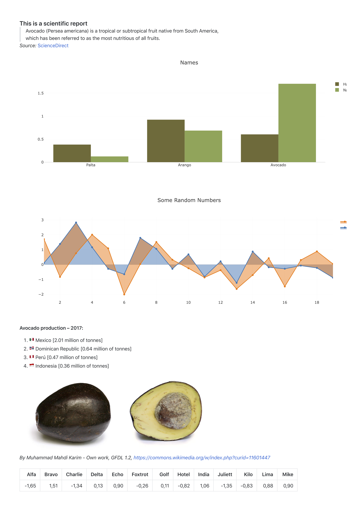

# scala-reportly
Minimal Scala lib to produce self contained HTML reports for scientific projects

### Example
```scala
  val labels = Seq("Banana", "Banano", "Grapefruit")
  val valuesA = labels.map(_ => new java.util.Random().nextGaussian())
  val valuesB = labels.map(_ => 0.5 + new java.util.Random().nextGaussian())
    
  val html = Reportly()
    .add("### Some highly informative plots")
    .add(
      Seq(Bar(labels, valuesA).withName("A"), Bar(labels, valuesB).withName("B")),
      Layout().withTitle("Test"))
    .render("test")
```

### Screenshot
